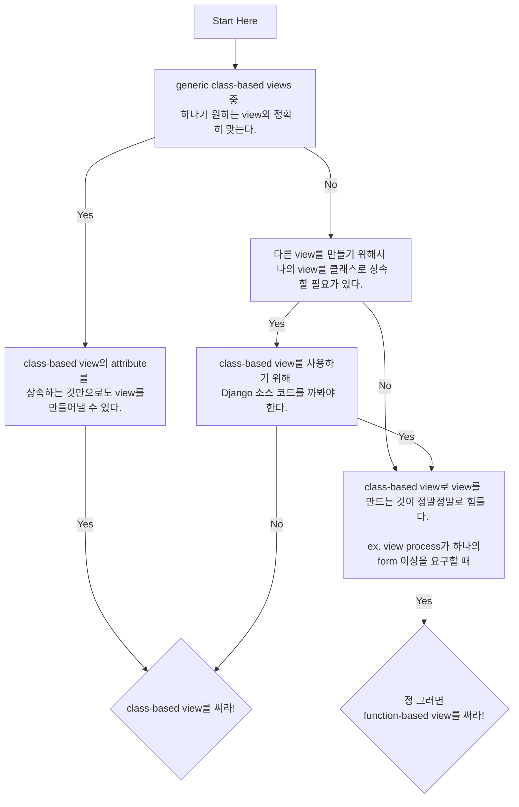

# 8. Function- And Class-Based Views

## 8.1 When to Use FBVs or CBVs



> [!IMPORTANT]
> 대부분의 경우 **CBV(Class-based view)**를,  
> **FBV(Function-based view)**의 경우 custom 에러 view를 만들거나 CBV로 만들기에 복잡한 view를 만들 때 사용해라

## 8.2 Keep View Logic Out of URLConf

Requests route를 **URLConfs**로 구성할 수 있다. 해당 모듈은 보통 `urls.py`로 구성된다.
URL을 구성하는 The rules of thumb(경험으로 얻어낸 원칙)은 다음과 같다.

1. view module은 view logic만 포함해야한다.
2. URL module은 URL logic만 포함해야한다.

> [!WARNING]
```python
# Don't do this!
from django.urls import path
from django.views.generic import DetailView
from tastings.models import Tasting

urlpatterns = [
  path('<int:pk>',
      DetailView.as_view(
        model=Tasting,
        template_name='tastings/detail.html'),
      name='detail'),
  path('<int:pk>/results/',
      DetailView.as_view(
        model=Tasting,
        template_name='tastings/results.html'),
      name='results'),
]
```

위의 코드는 다음의 규칙들을 위반한다.

- **Loose coupling** view와 url과 model이 tight하게 결합되어있다. 즉 view definition을 다시 재사용할 수 없게 만든다.
- **Don't Repeat Yourself** CBV들끼리 비슷한 args가 반복되어 사용된다.
- **Infinite flexibility is destroyed**: Class 상속이 CBV의 큰 장점인데, 이렇게 코드를 짜면 다시 사용하지 못하게 만든다.
- 만약 위 view에서 authentication 과정을 추가한다면? 각 `URLConf`를 decorator로 일일히 감쌀껀가?

## 8.3 Stick to Loose Coupling in URLConf

다음과 같이 위의 코드를 전환할 수 있다.

`tasting/views.py`
```python
from django.urls import reverse
from django.views.generic import ListView, DetailView, UpdateView

from .models import Tasting

class TasteListView(ListView):
  model = Tasting

class TasteDetailView(DetailView):
  model = Tasting

class TasteResultsView(TasteDetailView):
  template_name = 'tastings/results.html'

class TasteUpdateView(UpdateView):
  model = Tasting

  def get_success_url(self):
    return reverse('tastings:detail',
               kwargs={'pk': self.object.pk})
```

`tasting/urls.py`
```python
from django.urls import path

from . import views

urlpatterns = [
   path(
     route='',
     view=views.TasteListView.as_view(),
     name='list'
  ),
  path(
    route='<int:pk>/',
    view=views.TasteDetailView.as_view(),
    name='detail'
  ),
  path(
     route='<int:pk>/results/',
     view=views.TasteResultsView.as_view(),
     name='results'
  ),
  path(
     route='<int:pk>/update/',
     view=views.TasteUpdateView.as_view(),
     name='update'
  )
]
```

- **Don't Repeat Yourself** Args나 attribute가 view들끼리 공유되지 않는다.
- **Loose coupling** model과 template name을 URLConf에서 제외했다. URLConf에서는 URL 관련한 로직만 적고, view에 대한 로직은 views.py에 적는다.
- **URLConfs should do one thing: "Routing" and do it well** Routing에 대한 정보만 `urls.py`에 집중한다.
- **Class inheritance**: Class 상속을 통해서 겹치는 코드, 로직을 편하게 작성할 수 있다.

## 8.4 Use URL Namespaces

URL Namespaces는 `app-level`, `instance level`에서의 식별자 역할을 한다.
URL Namespace는 쓸모 없는 것처럼 보이지만 한번 써보면 왜 미리 쓰지 않았나라는 생각을 하게 된다. ㅋ

> **tastings_detail** 대신에 **tastings:detail**으로 쓰면서 URL Namespace를 이용할 수 있다.

`rootDir/urls.py`
```python
urlpatterns += [
    path('tastings/', include('tastings.urls', namespace='tastings')),
]
```

최상위 `URLConf`에서 다음과 같이 작성해줄 수 있다.
URL namespace를 이용하면 이전의 views.py 코드를 다음과 같이 바꾸어줄 수 있다.

`tastings/views.py`
```python
class TasteUpdateView(UpdateView):
  model = Tasting

def get_success_url(self):
  return reverse('tastings:detail',
               kwargs={'pk': self.object.pk})
```

HTML template에서도 다음과 같이 쓸 수 있다.

`taste_list.html`
```python


Tastings


<ul>
  
    <li>
      <a href="">
        {{ taste.title }}
      </a>
      <small>
        (<a href="">update</a>)
      </small>
    </li>
  
</ul>

```

## 8.4.1 Makes for Shorter, More Intuitive, and Don’t Repeat Yourself URL Names

`tastings_detail`, `tastings_results`과 같이 app 이름이나 model 이름을 사용한 URL name을 사용하지 말고
`detail`, `results`와 같은 간단한 이름을 사용해라.

## 8.4.2 Increases Interoperability With Third-Party Libraries

`<myapp>_detail`과 같은 URL name이 가장 큰 문제가 될 때는 app 이름이 변경될 때이다. URL namespace가 이와 같은 문제를 편하게 해결할 수 있게 만들어준다.

