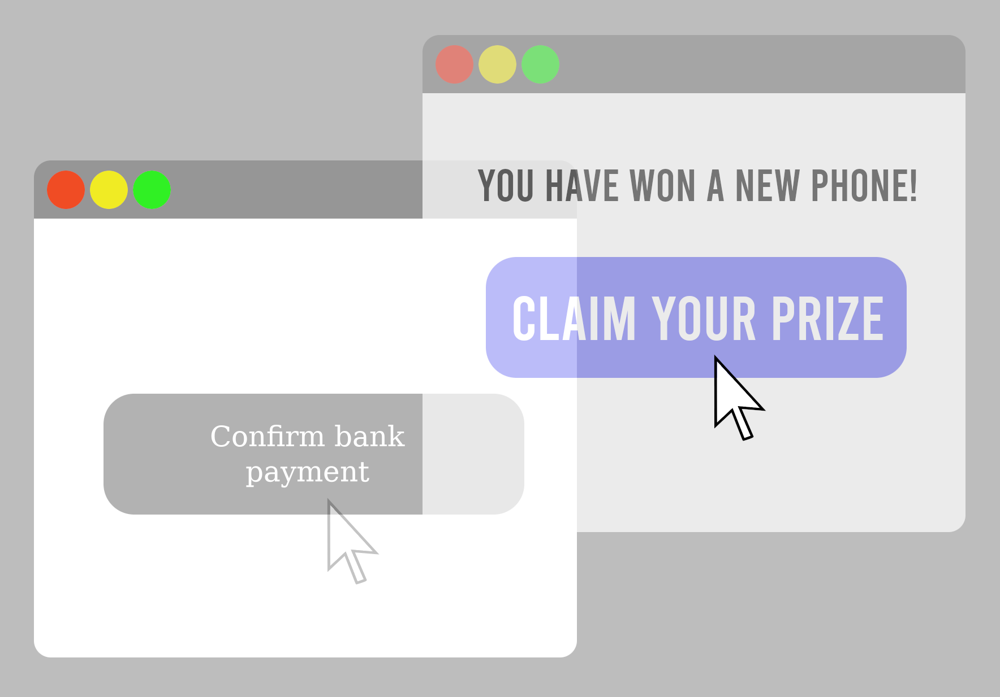

# 28. SecurityBestPractices

## 28.2 Harden Your Servers

서버 강화에 대한 지침과 체크리스트를 온라인에서 검색하라. 서버 강화 조치에는 방화벽 설정(help.ubuntu.com/community/UFW), SSH 포트 변경, 불필요한 서비스 비활성화/제거 등이 포함되지만 이에 국한되는 것은 아니다.

## 28.3 Know Django’s Security Features

## 28.4 Turn Off DEBUG Mode in Production

production 환경에서 **DEBUG** Mode가 켜져 있다면 공격자들이 이를 활용할 수 있다.

**DEBUG** 모드를 끄면 **ALLOWED_HOSTS**를 설정해야 한다. 그렇지 않으면 디버그하기 어려울 수 있는 400 BAD REQUEST 오류가 생성되는 SuspiciousOperation error가 발생할 위험이 있다.

## 28.5 Keep Your Secret Keys Secret
## 28.6 HTTPS Everywhere

> [!NOTE]
> TIP: Use django.middleware.security.SecurityMiddleware
>
> 미들웨어를 통해 전체 사이트에 HTTPS/SSL을 적용하기 위해 Django 프로젝트에 선택되는 도구가 내장되어 있다. 이 미들웨어를 활성화하려면 다음 단계를 따르라.
> 1. django.middleware.security.SecurityMiddleware를 settings.MIDDLEWARE 정의에 추가하세요.
> 2. settings.SECURE_SSL_REDIRECT를 True로 설정합니다.

### 28.6.1 Use Secure Cookies

당신의 사이트는 HTTPS를 통하지 않는 한 쿠키를 절대 보내지 않도록 대상 브라우저에 알려야 한다. 이를 위해선 설정에서 다음을 설정해야 한다.

**예제 28.1: Securing Cookies**

```python
SESSION_COOKIE_SECURE = True
CSRF_COOKIE_SECURE = True
```
참조: https://docs.djangoproject.com/en/3.2/topics/security/#ssl-https

## 28.7 Use Allowed Hosts Validation (ALLOWED_HOSTS 설정하기)

## 28.8 Always Use CSRF Protection With HTTP Forms That Modify Data

데이터 변경 양식이 기본적으로 서버 측에서 CSRF 보호를 활성화하는 POST 메소드를 사용하는지 확인하라.

GET 메소드를 사용하는 유일한 예외상황은 검색 양식에 대한 것이다. 여기서는 사용자가 URL에 인수를 표시하는 것이 유용하다.

## 28.11 Validate All Incoming Data With Django Forms

Django form은 웹 소스가 아닌 소스를 포함하여 프로젝트로 가져오는 모든 데이터의 유효성을 검사하는 데 사용해야 한다. 그렇게 하면 데이터의 무결성이 보호되고 애플리케이션 보안의 일부가 된다.

> [!NOTE]
> TIP: Using DRF Serializers Instead of Django Forms
> 
> DRF에 더 익숙하다면 serializer를 사용하여 들어오는 모든 데이터의 유효성을 검사하는 것이 좋다.

## 28.12 Disable the Autocomplete on Payment Fields

## 28.14 Don’t Use ModelForms.Meta.exclude

## 28.15 Don’t Use ModelForms.Meta.fields = ```"__all__"```

## 28.16 Beware of SQL Injection Attacks

## 28.18 Monitor Your Sites

## 28.19 Keep Your Dependencies Up-to-Date

항상 Django와 third-party dependencies를 최신 안정 릴리스로 업데이트하라. 이는 릴리스에 보안 수정 사항이 포함된 경우 특히 중요하다. 이를 위해 PyPI가 제공하는 최신 버전과 비교하여 요구 사항 파일을 자동으로 확인하는 [pyup.io](https://safetycli.com/?utm_source=pyupio&utm_medium=redirect&utm_campaign=pyup_rd&utm_id=0817&utm_content=marketing)를 권장한다.

## 28.20 Prevent Clickjacking

Clickjacking은 악성 사이트가 사용자가 숨겨진 프레임이나 iframe에 로드한 다른 사이트의 숨겨진 요소를 클릭하도록 속이는 것이다. 예를 들어 실제로는 다른 사이트의 구매 버튼인 허위 소셜 미디어 '로그인' 버튼이 있는 사이트가 있을 수 있다.

참조: https://docs.djangoproject.com/en/3.2/ref/clickjacking/


## 28.23 Embrace SecurityMiddleware
## 28.24 Force the Use of Strong Passwords

|Quality|Password Specification|
|--|--|
|Bad|6~10개의 알파벳|
|Okay|최소 8자, 대소문자+숫자+특수문자 혼합|
|Better|알파벳만으로 최소 30자 이상|
|Best|최소 30자, 대소문자+숫자+특수문자 혼합|
## 28.25 Don’t Prevent Copy/Pasting of Password

비밀번호 복사/붙여넣기를 허용하지 않으면. 사용자가 기억하기 쉽거나 반복적으로 사용되는 비밀번호에 의존하도록 권장하는 anti-pattern이다.

## 28.27 Put Up a Vulnerability Reporting Page

사용자가 보안 취약점을 보고할 수 있는 방법에 대한 정보를 사이트에 게시하는 것은 좋은 방법이다.

GitHub의 "보안 취약점에 대한 책임 있는 공개" 페이지가 좋은 예시이며 문제 보고자 이름을 게시하여 보상할 수 있다.

참조: help.github.com/articles/responsible-disclosure-of-security-vulnerability/
## 28.28 Never Display Sequential Primary Keys

Sequential Primary Key를 표시하지 말아 하는 이유로는
1. 잠재적인 라이벌이나 해커가 볼륨에 대해 알려있다.
2. 순차적 키 값을 표시함으로써 안전하지 않은 직접 개체 참조를 악용하는 것이 쉬워진다.
3. XSS 공격 대상을 제공한다.

### 28.28.1 Lookup by Slug

### 28.28.2 UUIDs

**예제 28.9: Using UUID for Public Lookups**

```python
import uuid
from django.db import models

class IceCreamPayment(models.Model): 
    uuid = models.UUIDField(
        unique=True, 
        default=uuid.uuid4, 
        editable=False)

    def __str__(self): 
        return str(self.pk)
```

**예제 28.10: Looking Up Payment By UUID**
```python
>>> from payments import IceCreamPayment
>>> payment = IceCreamPayment()
>>> IceCreamPayment.objects.get(id=payment.id) 
<IceCreamPayment: 1>
>>> payment.uuid
UUID('0b0fb68e-5b06-44af-845a-01b6df5e0967')
>>> IceCreamPayment.objects.get(uuid=payment.uuid)
<IceCreamPayment: 1>
```
## 28.29 Upgrade Password Hasher to Argon2

